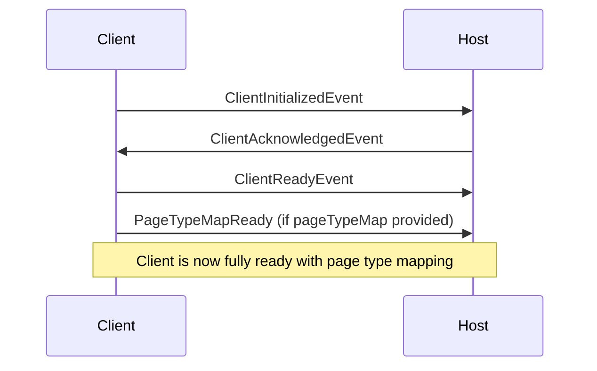

# Page Type Map Integration

## Overview

The Page Type Map integration allows the Page Designer client to communicate route-to-page-type mappings to the host application during the initial handshake. This enables the host to associate routes with their corresponding page types for design-time functionality.

## Architecture

The integration follows a **separation of concerns** approach by using a dedicated event (`PageTypeMapReady`) that is sent **after** the initial `ClientReady` handshake, rather than bundling it with the initial connection.

## Event Flow



## Implementation Details

### 1. New Event Type: `PageTypeMapReady`

**File:** `src/design/messaging-api/domain-types.ts`

```typescript
export interface PageTypeMapReady extends WithBaseEvent {
  eventType: 'PageTypeMapReady';
  clientId: string;
  pageTypeMap: Record<string, string>;
}
```

This event is emitted by the client to the host after `ClientReady` and contains:
- **clientId**: The ID of the client
- **pageTypeMap**: A mapping of route paths to page type names (in camelCase)
  - Example: `{ "/": "homePage", "/product/:productId": "productDetailPage" }`

### 2. Event Mapping

**File:** `src/design/messaging-api/api-types.ts`

Added `PageTypeMapReady` to the `HostEventNameMapping` interface so the host can subscribe to this event.

### 3. Client Configuration

**File:** `src/design/messaging-api/api-types.ts`

Extended `ClientConfiguration` to accept an optional `pageTypeMap`:

```typescript
export interface ClientConfiguration extends IsomorphicConfiguration {
  // ... existing fields
  pageTypeMap?: Record<string, string>;
}
```

### 4. Client API Implementation

**File:** `src/design/messaging-api/client.ts`

The `createClientApi` function now:
1. Accepts `pageTypeMap` as a configuration parameter
2. Emits `PageTypeMapReady` event after `ClientReady` if the map is provided and not empty

```typescript
prepareClient()
  .then(() => {
    isReady = true;
    messenger.emit('ClientReady', {clientId: id});
    
    // Emit PageTypeMapReady event after ClientReady if pageTypeMap is provided
    if (pageTypeMap && Object.keys(pageTypeMap).length > 0) {
      messenger.emit('PageTypeMapReady', {
        clientId: id,
        pageTypeMap,
      });
    }
    
    onHostConnected?.(hostConfig as ClientAcknowledgedEvent);
  })
```

### 5. React Provider Integration

**Files:**
- `src/design/react/context/PageDesignerProvider.tsx`
- `src/design/react/context/DesignContext.tsx`

Both providers now accept an optional `pageTypeMap` prop that is passed through to the client API:

```typescript
<PageDesignerProvider 
  clientId="odyssey" 
  targetOrigin="*" 
  pageTypeMap={pageTypeMap}
>
  {/* Your app content */}
</PageDesignerProvider>
```

## Usage Example

### In Your Application

```typescript
import { pageTypeMap } from 'virtual:page-type-map';
import { PageDesignerProvider } from '@salesforce/commerce-sdk-isomorphic/design';

function App() {
  return (
    <PageDesignerProvider 
      clientId="odyssey" 
      targetOrigin="*" 
      pageTypeMap={pageTypeMap}
    >
      <YourAppContent />
    </PageDesignerProvider>
  );
}
```

### On the Host Side

The host can subscribe to the `PageTypeMapReady` event:

```typescript
hostApi.on('PageTypeMapReady', (event) => {
  console.log('Received page type mapping:', event.pageTypeMap);
  // Example output:
  // {
  //   "/": "homePage",
  //   "/product/:productId": "productDetailPage",
  //   "/category/:categoryId": "categoryPage"
  // }
});
```

## Benefits of This Approach

1. **Separation of Concerns**: Page type mapping is a distinct concern from the initial connection handshake
2. **Optional Feature**: The mapping is only sent if provided, keeping the core handshake lightweight
3. **Non-Blocking**: The host receives the mapping as a separate event and can process it independently
4. **Extensible**: Additional metadata can be added to the event in the future without affecting the core handshake
5. **Type-Safe**: Full TypeScript support with proper event typing

## Generated Mapping Example

Given these route files with `@PageType` decorators:

- `src/routes/_index.tsx` → `@PageType({ name: 'Home Page' })`
- `src/routes/product.$productId.tsx` → `@PageType({ name: 'Product Detail Page' })`
- `src/routes/category.$categoryId.tsx` → `@PageType({ name: 'Category Page' })`

The Vite plugin generates:

```typescript
export const pageTypeMap = {
  "/": "homePage",
  "/product/:productId": "productDetailPage",
  "/category/:categoryId": "categoryPage"
};
```

This mapping is then passed to `PageDesignerProvider` and automatically sent to the host during initialization.

## Files Modified

1. **`src/design/messaging-api/domain-types.ts`** - Added `PageTypeMapReady` event interface
2. **`src/design/messaging-api/api-types.ts`** - Updated event mappings and client configuration
3. **`src/design/messaging-api/client.ts`** - Implemented event emission logic
4. **`src/design/react/context/PageDesignerProvider.tsx`** - Added pageTypeMap prop
5. **`src/design/react/context/DesignContext.tsx`** - Passed pageTypeMap to client API

## Testing

The existing test infrastructure remains compatible. The `pageTypeMap` prop is optional, so existing tests continue to work without modification:

```typescript
<PageDesignerProvider clientId="test1" targetOrigin="*">
  {/* Test content */}
</PageDesignerProvider>
```

To test with a page type map:

```typescript
<PageDesignerProvider 
  clientId="test1" 
  targetOrigin="*"
  pageTypeMap={{ "/": "homePage", "/about": "aboutPage" }}
>
  {/* Test content */}
</PageDesignerProvider>
```
